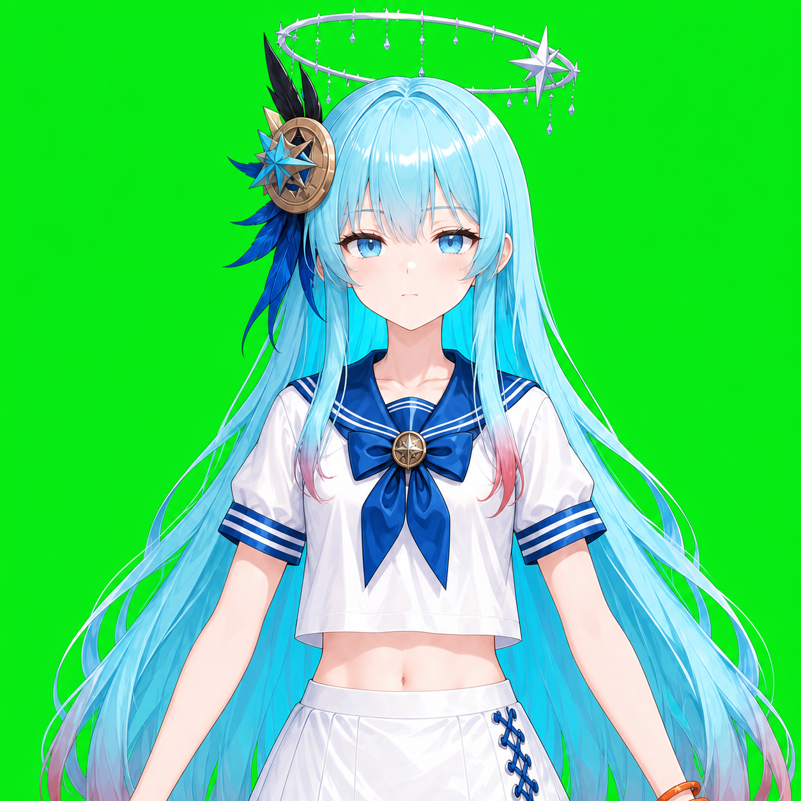
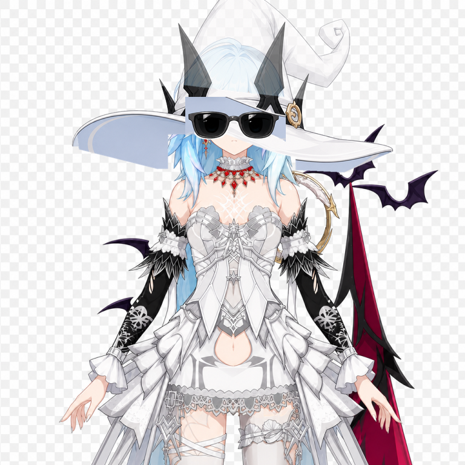

# Single Screenshot to Adapted Auto Live2D Workflow

This document records the full flow used for the `u5` and `u6` screenshot challenges: starting from one game screenshot, generating a clean upper-body anime portrait with Codex/image2, splitting it into PSD layers with see-through, then adapting it into an Auto Live2D Studio preset with camera tracking and optional differential attachments.

Reference assets for future agents:

- u3 default adapted preset: `public/samples/u3/input.psd`
- u3 validation example image: `docs/assets/u3-example.png`
- source game screenshot: `docs/assets/game-screenshot-source.png`
- green-screen upper-body composition reference: `docs/assets/green-upper-body-reference.png`
- u5 generated source image: `public/samples/u5/source.png`
- u5 adapted PSD: `public/samples/u5/input.psd`
- u6 no-hat/no-glasses source image: `public/samples/u6/source.png`
- u6 adapted PSD: `public/samples/u6/input.psd`
- u6 automatic attachment manifest: `public/samples/u6/attachments.json`
- u6 attachment preview: `docs/assets/u6-attachment-preview.png`
- u6 expression contact sheet: `docs/assets/u6-expression-contact.png`





## 0. Ask for Image Generation Access

Before starting the screenshot-to-character step, the agent should ask the user whether they have an image2-compatible image generation endpoint.

Required information:

- `baseURL`
- `api-key`
- whether the endpoint supports multi-image input/editing
- preferred model name, if it is not the default `gpt-image-2`

Do not write the user's API key into repository files, screenshots, logs, docs, or exported finished packs. Keep it in the current shell environment, a local ignored config file, or the agent's temporary runtime state.

Suggested agent question:

```text
Do you have an image2-compatible image generation API for this run? If yes, please provide baseURL, api-key, and whether it supports multi-image input. I will only use it during this run and will not save the key into the project.
```

If the user does not have image2 access, ask them to provide a clean generated upper-body character image manually, then continue from the see-through PSD split step.

## Goal

Produce a front-facing, upper-body, transparent-background character that matches this project structure:

`back hair -> arms/hands -> torso/top wear -> neck -> face -> eye whites -> irises -> mouth/nose -> brows/lashes -> side/front hair -> obj/accessories/expression overlays`

The output does not need Cubism/Inochi export. It should be a ready-to-import Auto Live2D Studio project/preset that can drive:

- head X/Y/Z, including proxy-head pseudo-3D projection
- blink, separate left/right blink, iris X/Y with socket clipping
- mouth open/form with centered mouth scaling
- small body sway and body-to-neck-to-head chaining
- arms from shoulder pivots
- hair/accessory inertia
- expression-difference overlays
- camera tracking

## 1. Prepare References

Use two image inputs for image2:

- The game screenshot as identity/costume reference.
- A clean green-screen upper-body reference as pose, framing, and lighting target.

Keep the target portrait:

- front-facing
- upper body to lower abdomen
- arms visible and separable
- face unobstructed
- transparent or plain background if possible
- no strong perspective
- no hands covering face

Prompt pattern:

```text
Create a clean front-facing anime upper-body portrait of the character in image 1, using image 2 as pose/framing reference. Keep the character visible from head to lower abdomen. Use a neutral T-pose or relaxed front-facing pose with both arms separable. Keep eyes, irises, lashes, brows, mouth, face plate, front hair, side hair, back hair, torso, arms, hands, clothes, and accessories visually separable for PSD layer splitting. Avoid merged eyes, opaque background, extreme perspective, crossed arms, hands covering the face, and heavy shadows. Output a polished transparent-background anime character suitable for Live2D-style rigging.
```

For hats, masks, large hair ornaments, or props, also generate differential references:

- no-hat base portrait
- hat front layer
- hat back layer
- no-glasses base portrait if eyewear should become a removable object
- any dangling ornament/feather/tassel layer

These differential images can be split into PSDs and mounted as `obj` layers under a standard parent layer.

For expression variants, use full-character differentials first:

- same full body crop and head pose as the base
- only the expression changes
- same eye spacing, mouth position, line weight, lighting, and painting style
- transparent or plain background

Then run the full differential through see-through and crop/import the needed eye, mouth, or face patch. This avoids the common failure where image2 creates isolated heart-eye or mouth icons that do not match the base face.

For `u6`, the stable main PSD uses the no-hat/no-glasses image. A second multi-image image2 edit generated the hat and black glasses accessory reference from:

- image 1: the no-hat/no-glasses target alignment
- image 2: the hat/glasses style reference

The generated accessory image was cleaned into transparent PNG layers and stored in `public/samples/u6/attachments/`. This is acceptable when the differential is already a clean isolated object and does not need another see-through pass.

## 2. Run see-through PSD Split

Use the bundled see-through project at `third_party/see-through`:

```powershell
cd .\third_party\see-through
$env:SEE_THROUGH_ROOT = (Get-Location).Path
powershell -ExecutionPolicy Bypass -File .\setup_windows.ps1
```

The setup script creates the Windows `assets` junction. The first inference run downloads the LayerDiff/Marigold model weights, so it can take a while. If the bundled directory is absent, clone the unmodified upstream source from `https://github.com/shitagaki-lab/see-through.git` and follow its README.

The successful u5 command used local NF4 models. From the bundled `third_party/see-through` directory, resolve both repository roots and run:

```powershell
$autoLive2dRoot = (Resolve-Path '..\..').Path
$seeThroughRoot = (Get-Location).Path
& "$seeThroughRoot\.venv\Scripts\python.exe" `
  "$seeThroughRoot\inference\scripts\inference_psd_quantized.py" `
  --srcp "$autoLive2dRoot\outputs\u5\u5_generated.png" `
  --save_to_psd --resolution 768 --num_inference_steps 15 --cpu_offload `
  --repo_id_layerdiff 'workspace\models\layerdiff3d_nf4' `
  --repo_id_depth 'workspace\models\marigold_nf4'
```

Notes:

- The batch wrapper may pass arguments incorrectly after `shift`; direct Python invocation is safer.
- 768 resolution and 15 steps were enough for the u5 preset on this machine.
- see-through can accept the image directly; pre-cutting the character is not required for the current workflow.
- Keep the generated PSD and optional depth PSD together.
- Save final built-in presets under `public/samples/<id>/input.psd`.

## 3. Import and Adapt in Auto Live2D Studio

1. Add the sample id in:
   - `src/lib/psdImport.ts`
   - `src/App.tsx`
   - `vite.config.ts`
2. Load the PSD through the UI.
3. Check the import report.
4. Unknown/accessory/non-standard layers are now treated as `obj` attachments, not discarded.
5. For each `obj`, choose a standard parent layer or parent bone:
   - hat front: front hair/head
   - hat back: back hair/head
   - feather/tassel: front hair or accessory
   - loose clothing object: top wear/body
6. Tune z-order so higher visual layers always cover lower layers.
7. Use proxy-head mode and manual mode to compare head turns.
8. Save parameter records once a tuning feels good.

Built-in presets can also ship a companion manifest:

```text
public/samples/<id>/attachments.json
public/samples/<id>/attachments/*.png
```

When a sample is loaded, `src/lib/sampleAttachments.ts` reads this manifest and injects the PNG layers as normal mesh layers. This is how `u6` mounts:

- `hat_back`: `obj`, parent bone `hair-back`
- `hat_front`: `obj`, parent bone `hair-front`
- `glasses`: `obj`, parent bone `face`
- `back/front hair volume clone`: low-opacity `cloneOf` layers that reuse imported hair meshes and blend their average pseudo-Z toward the face for extra head-turn volume; keep each clone's draw `z` in its original visible band
- `heart-eyes`, `shocked-eyes`, `glowing-eyes`, `white-eye-ring`, `spiral-eyes`: expression layers in `eye-expression`
- `blush`: expression layer in `face-overlay`
- `open-mouth`: expression layer in `mouth-expression`

## 4. Required Adaptation Checks

Run these checks for every new preset:

- neutral load has no white screen
- head X/Y max does not tear face, eyes, hair, or neck apart
- head Z is a planar tilt around the adjustable neck/head pivot
- proxy-head mode looks rounded but does not shrink front hair too much
- irises move X and Y, and socket clipping hides overflow
- blink closes lashes/lids instead of just fading eyes
- mouth open scales around its own center and does not drift on the face
- body motion carries neck and head, with no "decapitation" gap
- arms rotate around shoulder roots; if either side folds inward, use the per-side arm rotation reversal option and save it with the project
- pose tracking starts with current real arm positions as arm zero, then only relative arm movement drives the model
- hair roots stay near face/head, while tips have inertia
- back hair and side/front long strands have visible tail drag
- all expression presets render normally
- green/transparent backgrounds work for OBS/runtime
- runtime small-window framing works: drag, wheel/slider scale, synchronized editor tracking parameters/settings, and out-of-canvas hat/accessory overscan

Use the fixed validation flow:

```powershell
npm run build
npm run validate:ui -- --preset u3 --out "$env:TEMP\autoLive2d-u3-validation"
npm run validate:ui -- --preset u4 --out "$env:TEMP\autoLive2d-u4-validation"
npm run validate:ui -- --preset u5 --out "$env:TEMP\autoLive2d-u5-validation"
```

## 5. Obj Attachments

All extra split parts that do not match the standard semantic structure should become `obj` attachments.

An `obj` attachment:

- remains a normal renderable mesh layer
- has its own z-order, mesh, pseudo-Z, pivot, and optional physics
- can choose a standard parent layer
- inherits motion from the selected parent layer's parent bone
- can be used for hats, loose props, feathers, detached ornaments, extra clothing details, and cleanup patches

If a PSD split merges a hat into the main portrait, generate no-hat and hat differential images with image2, split those differentials, then mount the useful hat front/back pieces as `obj` layers.

## 6. Expression Differentials

Generate expression differentials with image2 when the base PSD lacks enough expression material:

- heart eyes
- shocked eyes
- blush
- open-mouth oral cavity texture
- glowing eyes
- embarrassed white eye ring
- hypnotic spiral eyes

Split each differential image into PSD layers and import it through `表情差分 PSD`.

Expression layers:

- are normal mesh layers with an `expression` attachment
- belong to an `exclusiveGroup`, such as `eye-expression`
- have an `expressionKey`, such as `heart-eyes`
- are hidden unless their group currently selects that key
- can be switched in the editor and exported runtime

Use different groups when effects should stack, for example `eye-expression` plus `face-overlay`. Use the same group when effects should compete, for example heart eyes versus spiral eyes.

For clean, small expression patches, transparent PNG companion layers are valid only when they are cropped from an aligned full-character differential or otherwise proven to match the base eye sockets and mouth position.

Important u6 lesson: the first u6 expression PNGs were too icon-like. The repaired heart-eye and open-mouth patches were generated as complete aligned character portraits, split with see-through, then cropped from `irides.png` or `mouth.png`. This keeps eye spacing, face position, line weight, and mouth style close to the base portrait. Do not regenerate only tiny isolated eyes or a generic mouth.

## 7. Cross-Project Part Reuse

An adapted project can borrow a standard part from another adapted project.

Use case:

- select current iris layer
- load another `.rig.json` project through `加载部件工程`
- choose a compatible iris layer
- click `替换当前贴图`

The current layer keeps its binding, mesh, z-order, parent, pseudo-Z, and deformers. Only the transparent texture image and opacity/blend mode are replaced. This is the safest material-replacement behavior for same-structure projects.

## 8. Finished Pack Export

Use `成品包 ZIP` after adaptation.

The ZIP contains:

- `project.json`: ready-to-import project with embedded layer images
- `adapter.json`: binding/depth/physics/expression parameter summary
- `template.json`: reusable material-replacement template
- `runtime.html`: standalone runtime preview
- `reference.png`: current composite reference
- `layers/*.png`: transparent layer debug images
- `manifest.json`

The browser cannot always include the original PSD binary, so `project.json` is the deployment source of truth. It embeds the adapted layer images and all binding parameters. If an external archive must keep the original PSD, place it next to the exported pack manually.

Import a finished pack with `导入成品包`; no AI re-adaptation should be required.

## 9. Adding a Built-In Preset

For a new preset `u6`:

1. Save source image at `public/samples/u6/source.png` if available.
2. Save PSD at `public/samples/u6/input.psd`.
3. Save depth PSD as `public/samples/u6/input_depth.psd` if available.
4. Extend `SamplePsdPreset` in `src/lib/psdImport.ts`.
5. Extend `samplePresets` in `src/App.tsx`.
6. Extend `samplePsdPaths` in `vite.config.ts`.
7. If the preset has auto-mounted accessories or expressions, add `public/samples/u6/attachments.json` and transparent PNGs under `public/samples/u6/attachments/`.
8. Run inspect/build/UI validation.
9. Export a finished pack for transfer.

For future agents: keep u3 as the first regression target because it is the most stable currently adapted baseline.

## 10. Detailed Agent Playbook: One Screenshot to Face-Tracked Finished Character

Use this as the full repeatable recipe when an agent receives exactly one game screenshot and must deliver a ready Auto Live2D Studio preset.

### Phase A: Decide the target structure before generating art

The final character should be an upper-body, front-facing, mostly symmetrical portrait. The easiest PSDs to adapt are those where the image generator leaves visual separation between:

- back hair
- side hair and long front strands
- front hair/bangs
- face plate
- eye whites or eye sockets
- irises/pupils
- lashes/lids
- brows
- nose
- mouth
- neck
- top wear/chest cloth
- bottom wear or hip cloth, if visible
- left/right arms and hands
- hats, glasses, feathers, ribbons, wings, props, and other accessories

Do not try to solve everything in the first generated image. The base PSD should prioritize a clean body/head/hair split. Accessories and expressions are often better as differential companion layers.

### Phase B: Generate the base portrait

Use image2 with the original screenshot as identity/costume reference and a stable upper-body reference as pose/framing reference. The base prompt should ask for:

- same character identity, costume color, hair color, and key accessories
- front-facing anime style
- upper body from head to lower abdomen
- both arms visible and separable
- clean face, open eye area, visible mouth area
- no heavy shadows across eyes or mouth
- transparent or plain background

For hard accessories, explicitly ask for a no-accessory base when the accessory blocks rigging:

- no hat if the hat covers front/back hair
- no glasses if the glasses hide irises or eye whites
- no mask if the mouth needs tracking
- no prop crossing the torso or face

Save the generated base image under `outputs/<preset>/base/` and copy the accepted final base to `public/samples/<preset>/source.png`.

### Phase C: Split the base with see-through

Run see-through directly on the base image. Do not pre-cut the character unless the generator produced a truly unusable background. The see-through project can infer layers from the full image.

Keep all outputs:

- `input.psd`
- optional `input_depth.psd`
- reconstruction image
- per-layer PNGs
- stats/info JSON

The final built-in preset should store:

```text
public/samples/<preset>/input.psd
public/samples/<preset>/input_depth.psd
public/samples/<preset>/source.png
```

Inspect the PSD layer list. A good PSD has at least face, eyes/irises, mouth, front hair, back hair, neck, topwear, and arms/hands. If a critical layer is missing, generate another base image before overfitting the editor.

### Phase D: Load and adapt the PSD

Add the preset id to the sample list and load it in the UI. Then check:

- import does not produce a white screen
- merged two-eye layers are split or treated as center eye layers
- merged two-arm layers are split or mapped to left/right arms
- arms are under the torso by default and pivot around shoulder roots
- neck and topwear upper vertices stay welded enough to avoid decapitation
- face, eye sockets, lashes, brows, mouth, ears, hair, and accessories all follow the head
- body motion is small and carries neck/head as children

Tune the key project settings:

- head X/Y/Z safety limits
- body X/Y/Z safety limits
- face-neck pseudo-Z blend
- front/back hair neck blend
- clone front/back hair neck blend, if clone layers exist
- chin shrink
- iris vertical overshoot
- mouth open scale limit
- head Z roll pivot
- hair and accessory inertia
- arm shoulder pivots
- local x/y/draw-z/average-depth/scale/rotation for each problematic part

Important distinction:

- Draw `z` is visual stacking order.
- Mesh pseudo-Z is projection depth.
- Never fix a pseudo-Z problem by raising draw `z` into the wrong visual band.

### Phase E: Add volume clone layers

If head turns still feel like flat paper, add low-opacity clone layers.

For hair volume clones:

- use `cloneOf` in `attachments.json`
- source from the original PSD front/back hair
- blend average pseudo-Z toward face/neck using `depthRatio`
- keep opacity low, usually `0.18` to `0.35`
- keep draw `z` inside the original visible band
- mark the clone with `cloneKind` through the loader
- tune with `frontHairCloneNeckBlend` and `backHairCloneNeckBlend`

Back-hair clone example:

```json
{
  "id": "preset-back-hair-volume-clone",
  "kind": "backHair",
  "parentBoneId": "hair-back",
  "z": 11,
  "opacity": 0.22,
  "cloneOf": {
    "kind": "backHair",
    "sourceNameIncludes": "back hair",
    "depthTargetKind": "face",
    "depthRatio": 0.5
  },
  "attachment": {
    "type": "object"
  }
}
```

The loader writes `attachment.cloneKind` automatically. The editor then uses the clone-specific neck-blend sliders without affecting u3/u4/u5 or any preset without clone layers.

### Phase F: Split hats and large accessories

When image2 cannot generate clean hat front/back layers, generate one complete hat image and split it deterministically:

1. Align the complete hat to the no-hat base portrait.
2. Crop it as a transparent PNG.
3. Use the complete hat as `hat_back`.
4. Cut horizontally through the brim ellipse.
5. Use the region above the cut as `hat_front`.
6. Add a low-opacity full-hat clone as a volume filler.
7. Put the hat back layer behind back hair.
8. Put the hat front layer in front of front hair.
9. Give the volume filler `depthAnchor: "neck"` so it follows the head but projects at neck pseudo-Z.
10. Use `attachment.proxyGroup` to force hat back/filler into the proxy-head back composite when needed.

u6 uses this structure:

- `u6-hat-back`: complete hat, proxy back group, draw z behind back hair
- `u6-hat-front`: front slice cut from the complete hat, proxy front group
- `u6-hat-neck-depth-clone`: low-opacity complete-hat clone, proxy back group, `depthAnchor: "neck"`

This is more reliable than asking image2 for separate front/back hat images, which often changes the art style or cuts the brim incorrectly.

For the u6 hat, image2 first produced a complete white hat on a fake checkerboard background. The reliable cleanup flow was:

1. Flood-fill the edge-connected checkerboard pixels and convert them to real alpha.
2. Crop the remaining opaque hat with a small margin.
3. Resize the hat into the existing attachment frame so `attachments.json` bounds do not need to change.
4. Read the user-drawn red cut line from the guide screenshot and fit a straight line through the red pixels.
5. Map that line from screenshot coordinates into the fitted hat asset.
6. Save `hat_back.png` as the complete fitted hat.
7. Save `hat_front.png` as only the region above the diagonal brim line.
8. Keep the low-opacity full-hat clone using the complete back image and `depthAnchor: "neck"`.

This keeps the art stable, avoids asking image2 to invent mismatched front/back layers, and makes the cut line repeatable. If the hat is too low or high after fitting, adjust `bounds.y` in the manifest rather than re-scaling the PNG.

### Phase G: Add glasses and small accessories

Glasses should be face children:

- parent bone: `face`
- draw z above eyes/lashes but below optional front effects if needed
- low inertia, usually `0.15` to `0.3`
- no independent hair/cloth physics

Feathers, tassels, ribbons, and dangling ornaments should normally be children of front hair or accessory and can use accessory inertia.

### Phase H: Build expression differentials

Preferred path:

1. Generate a full-character expression portrait with image2.
2. Keep the same head angle, eye spacing, face size, and crop as the base.
3. Run the full expression portrait through see-through.
4. Crop the useful layer from the split PSD.
5. Mount it as an expression attachment.

Avoid isolated tiny eye or mouth icons unless they are only temporary debugging placeholders. Isolated icons often have the wrong line weight, wrong perspective, wrong eye spacing, and wrong mouth style.

Expression groups:

- `eye-expression`: heart eyes, shocked eyes, glowing eyes, white ring eyes, spiral eyes
- `face-overlay`: blush and sweat marks
- `mouth-expression`: open-mouth oral cavity or special mouth patch

Merged two-eye expression PNGs should either:

- have no `side`, so the renderer treats them as a center/double-eye layer and does not clip them to only one socket, or
- be split into separate left/right expression layers with matching `side`.

For built-in transparent PNG expression eyes, verify alignment by measurement, not only by a full-screen screenshot:

1. Temporarily hide glasses or other eye-covering obj layers in the editor.
2. Turn off the eye-expression group and measure the rendered standard iris canvas alpha bounding box for each side.
3. Activate one expression key.
4. Measure the rendered expression iris canvas alpha bounding box for the same side.
5. Compare centers in stage pixels.
6. If the expression center is off, shift the expression PNG content inside its transparent frame. Do not edit the standard iris movement code and do not move the base iris.

This matters because `kind: "iris"` expression overlays use the same socket clamp as standard irises. The mesh can be centered correctly while the visible symbol is still off-center inside its PNG. Fix the PNG content center first. Only change manifest bounds when the whole expression layer, not just its painted pixels, is in the wrong place.

For mouth expression patches, compare against the standard `mouth` layer. Mouth patches are not socket-clamped, so their manifest `bounds` must place the patch center on the standard mouth center. The u6 open-mouth patch was centered horizontally but too high, so its `bounds.y` was moved down while keeping the standard mouth layer and standard mouth-open deformation unchanged.

Blush should sit under the eyes on the cheeks, not on the mouth or chest. For u6, the blush patch is a face child in `face-overlay`, with bounds centered below the eye line.

### Phase I: Package the adapted preset

For a built-in sample, ship:

```text
public/samples/<preset>/input.psd
public/samples/<preset>/input_depth.psd
public/samples/<preset>/source.png
public/samples/<preset>/attachments.json
public/samples/<preset>/attachments/*.png
```

For sharing outside the repo, export a finished pack ZIP. A finished pack should open without AI re-adaptation and should include:

- embedded project images
- adapter settings
- template settings
- runtime HTML
- reference PNG
- layer PNGs
- manifest

### Phase J: Validate before handing off

Run at least:

```powershell
npm run build
npm run validate:ui -- --preset <preset> --out ".rig-validation-<preset>"
```

For compatibility, also run one stable old preset:

```powershell
npm run validate:ui -- --preset u3 --out ".rig-validation-u3-regression"
```

Visually inspect:

- neutral
- left/right look
- happy/angry/sleep/shocked presets
- head X/Y/Z maximums
- proxy-head X maximum
- body X/Y/Z maximums
- iris X/Y maximums
- mouth open maximum
- arms up
- arm tracking zero calibration and left/right arm rotation reversal
- expression buttons
- hidden-layer click behavior
- green/checker/transparent background

The adaptation is not finished until the model survives both automated screenshots and a direct browser check.
